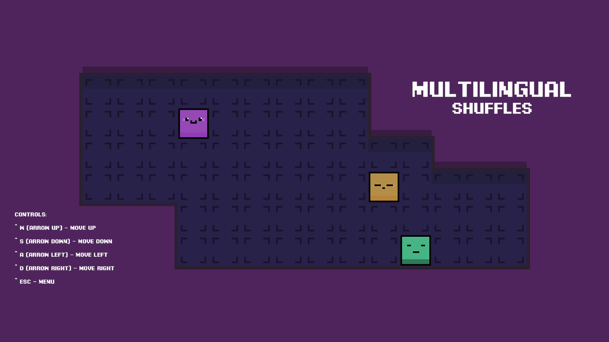

# Multilingual Shuffles

### Задание

При запуске игре загружается начальная сцена, в ней есть ваш персонаж, а также 2-3 других бота. Управляя персонажем вы подходите к любому из них и начинается диалог на любую тему. В конце диалога загружается какой-нибудь уровень, в котором должна быть какая-нибудь мини-игра с элементами текста.

Все текстовая информация в игре должна быть локализована через `I2Localization`.

---

### Реализация

Доступные языки:

- Английский
- Русский
- Немецкий

В начальном уровне игроку необходимо подойти к одному из персонажей и начать диалог с ним.
Диалог доступен на разных языках. После завершения диалога игрок может перейти на уровень с мини-игрой.

**Main scene start**

**Dialog**

**Dialog switched to Russian language**

**Menu with choosing language**

---

#### Мини-игра

Суть мини-игры заключается в том, что игроку нужно собрать необходимую фразу из слов на разных языках как можно быстрее. По карте разбросаны блоки, каждый из которых содержит определенное слово (`разноцветные блоки, похожие на главного героя`). Для выполнения задания игрок должен забирать слова у блоков и приносить их по очереди к цели (`блоку с белой рамкой`) в правильном порядке.

Для усложнения задания в игру добавлены блоки со словами, которые не относятся к собираемой фразе, если игрок принесет к цели неверный блок, то у него отнимется жизнь. Также по карте разбросаны ямы (`блоки с черной меткой`), если игрок наступит в какую-либо из них у него также отнимется здоровье.

Для выигрыша необходимо собрать все фразы.

**Level**

**Level with gameplay**

**Level with gameplay on Deutch**

**Win**

